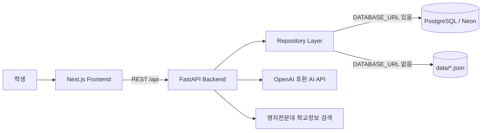

# MJC AI Campus Agent

명지전문대 학생의 수강신청, 시간표, 강의실 조회, 상담과 학교 정보 탐색을 하나로 연결한 AI 캠퍼스 비서입니다. **2026 AI 해커톤 경진대회** 코드한입조 프로젝트로, Next.js 프런트엔드와 FastAPI 백엔드를 실제 배포 환경까지 연결했습니다.

## 바로가기

| 서비스 | URL | 설명 |
|---|---|---|
| 웹앱 | [frontend-ten-alpha-5uxgevufyr.vercel.app](https://frontend-ten-alpha-5uxgevufyr.vercel.app/) | Vercel에 배포된 사용자 화면 |
| Backend API | [mjc-ai-campus-agent-backend-production.up.railway.app](https://mjc-ai-campus-agent-backend-production.up.railway.app/) | Railway에 배포된 FastAPI 서버 |
| 상태 확인 | [/health](https://mjc-ai-campus-agent-backend-production.up.railway.app/health) | Backend 정상 동작 확인 |
| Swagger | [/docs](https://mjc-ai-campus-agent-backend-production.up.railway.app/docs) | 대화형 REST API 문서 |

## 주요 기능

- **통합 대시보드**: 학생 정보, 다음 수업, 오늘의 시간표와 공지 확인
- **AI 캠퍼스 비서**: 과목 데이터와 명지전문대 학교정보 검색을 활용한 질의응답
- **과목 검색·수강신청**: 2026학년도 2학기 실제 개설강좌 246개 검색, 잔여석·시간 충돌 확인, 신청과 취소
- **주간 시간표**: 신청한 과목을 요일·교시별로 시각화
- **강의실 조회**: 건물과 강의실 정보 검색
- **상담 지원**: 상담 내역 조회, 상담 신청과 적성 분석
- **듀얼 데이터 모드**: 환경변수 하나로 Mock JSON 또는 PostgreSQL(Neon) 사용

## 구현 상태

- Backend Course, Student, Enrollment, Chat, Counseling, Building·Room API 구현
- OpenAI 호환 AI 클라이언트와 학교정보 RAG 연동
- Frontend 6개 화면과 Backend API 실연동
- Vercel Frontend, Railway Backend 배포
- Backend 테스트 105개 및 Frontend lint·production build 검증

## 기술 스택

| 영역 | 기술 |
|---|---|
| Frontend | Next.js 16.3, React 19.2, TypeScript, Tailwind CSS 4, Base UI/shadcn |
| Backend | Python 3.11+, FastAPI, Pydantic, SQLAlchemy |
| AI/RAG | OpenAI 호환 Chat Completions API, 명지전문대 웹 검색·본문 파싱 |
| Data | PostgreSQL(Neon) 또는 저장소의 Mock JSON |
| Deployment | Vercel, Railway |
| Quality | pytest, ESLint, TypeScript, Next.js production build |

## 시스템 구성



`DATABASE_URL`을 설정하지 않아도 Repository 계층이 `data/*.json`을 읽으므로 로컬에서 전체 기능을 빠르게 확인할 수 있습니다. DB를 연결하면 최초 실행 시 테이블을 만들고 Mock 데이터를 자동으로 시드합니다.

## 5분 Quick Start

### 사전 준비

- Git
- Python 3.11 이상
- Node.js 20 이상과 npm

### 1. 저장소 받기

```bash
git clone https://github.com/hoo419/mjc-ai-hackathon-codeonebite-team.git
cd mjc-ai-hackathon-codeonebite-team
```

모든 개발 내용은 기본 브랜치인 `main`에 통합되어 있습니다.

### 2. Backend 실행

Mock 모드는 API 키나 DB 없이 실행할 수 있습니다.

```bash
cd backend
python -m venv .venv
```

Windows PowerShell:

```powershell
.\.venv\Scripts\python.exe -m pip install -r requirements.txt
.\.venv\Scripts\python.exe -m uvicorn app.main:app --reload --port 8000
```

macOS/Linux:

```bash
source .venv/bin/activate
pip install -r requirements.txt
uvicorn app.main:app --reload --port 8000
```

정상 기동 여부를 확인합니다.

```bash
curl http://localhost:8000/health
# {"status":"ok"}
```

로컬 Swagger 문서: [http://localhost:8000/docs](http://localhost:8000/docs)

### 3. Frontend 실행

새 터미널에서 저장소 루트로 이동한 뒤 실행합니다.

```bash
cd frontend
npm install
npm run dev
```

[http://localhost:3000](http://localhost:3000)에서 웹앱을 확인할 수 있습니다.

## 환경변수

실제 `.env`와 `.env.local`은 커밋하지 않습니다. 예제 파일을 복사해 사용하세요.

### Backend: `backend/.env`

```bash
cp backend/.env.example backend/.env
```

| 변수 | 필수 | 설명 |
|---|---|---|
| `AI_API_BASE_URL` | 선택 | OpenAI 호환 API 기본 주소. 비우면 규칙 기반 응답으로 폴백 |
| `AI_API_KEY` | 선택 | AI 공급자 API 키 |
| `AI_MODEL` | 선택 | 호출할 모델 이름 |
| `DATABASE_URL` | 선택 | PostgreSQL 연결 문자열. 비우면 Mock JSON 모드 사용 |
| `CORS_EXTRA_ORIGINS` | 배포 시 | 추가 허용 Origin을 쉼표로 구분해 입력 |

AI와 DB 관련 값을 모두 비워도 Mock 데이터 기반으로 앱을 실행할 수 있습니다.

### Frontend: `frontend/.env.local`

```bash
cp frontend/.env.local.example frontend/.env.local
```

```env
NEXT_PUBLIC_API_BASE_URL=http://localhost:8000/api
```

배포 시에는 이 값을 Railway Backend의 `/api` 주소로 설정합니다.

## 테스트와 빌드

Backend 전체 테스트:

```bash
cd backend
python -m pytest -q
```

Frontend 정적 검사와 production build:

```bash
cd frontend
npm ci
npm run lint
npm run build
```

## 주요 화면

| 경로 | 화면 | 주요 기능 |
|---|---|---|
| `/` | 대시보드 | 학생 정보, 다음 수업, 오늘 시간표, 공지 |
| `/chat` | AI 비서 | 학교정보·과목 기반 질의응답과 관련 과목 카드 |
| `/courses` | 과목 검색 | 검색·필터, 수강신청과 취소 |
| `/schedule` | 시간표 | 신청 과목의 주간 시간표 |
| `/rooms` | 강의실 | 건물·강의실 정보 조회 |
| `/counseling` | 상담 | 상담 내역, 상담 신청, 적성 분석 |

## 주요 API

모든 비즈니스 API의 기본 경로는 `/api`입니다.

| Method | Endpoint | 설명 |
|---|---|---|
| `GET` | `/api/courses` | 과목 목록 검색·필터 |
| `GET` | `/api/courses/{course_id}` | 과목 상세 조회 |
| `GET`, `PATCH` | `/api/students/me` | 내 학생 정보 조회·수정 |
| `GET` | `/api/students/me/courses` | 신청한 과목 조회 |
| `GET` | `/api/students/me/schedule` | 내 시간표 조회 |
| `POST` | `/api/enrollment` | 수강신청 |
| `DELETE` | `/api/enrollment/{course_id}` | 수강 취소 |
| `POST` | `/api/chat` | AI 비서 질의 |
| `GET` | `/api/counseling/me` | 내 상담 정보 조회 |
| `POST` | `/api/counseling/request` | 상담 신청 |
| `POST` | `/api/counseling/analyze-aptitude` | 적성 분석 |
| `GET` | `/api/buildings` | 건물 목록 조회 |
| `GET` | `/api/rooms/{room_id}` | 강의실 상세 조회 |

요청·응답 형식은 [API_CONTRACT.md](./API_CONTRACT.md) 또는 [배포 Swagger](https://mjc-ai-campus-agent-backend-production.up.railway.app/docs)에서 확인하세요.

## 디렉터리 구조

```text
.
├── backend/
│   ├── app/api/           # FastAPI 라우터
│   ├── app/core/          # 설정, DB 연결, 초기 데이터 시드
│   ├── app/models/        # SQLAlchemy 모델
│   ├── app/rag/           # 학교정보 검색과 본문 파싱
│   ├── app/repositories/  # PostgreSQL/Mock 데이터 접근
│   ├── app/services/      # 비즈니스 로직과 AI 클라이언트
│   └── tests/             # Backend 테스트
├── frontend/
│   ├── src/app/           # Next.js App Router 화면
│   ├── src/components/    # 공통 UI와 앱 셸
│   ├── src/hooks/         # 공통 React 훅
│   └── src/lib/           # API 클라이언트와 도메인 유틸리티
├── data/                  # Mock JSON과 원본/변환 데이터
├── docs/                  # 설계, 구현 계획, 해커톤 산출물
├── API_CONTRACT.md        # REST API 계약
├── DEMO_SETUP.md          # 상세 로컬 실행 가이드
└── PROJECT_REQUIREMENTS.md
```

## 배포

- Frontend는 `frontend/`를 기준으로 Vercel에 배포합니다.
- Backend는 `backend/railway.json` 설정으로 Railway에 배포합니다.
- Frontend의 `NEXT_PUBLIC_API_BASE_URL`은 배포된 Backend의 `/api` 주소를 사용합니다.
- Backend의 `CORS_EXTRA_ORIGINS`에는 배포된 Frontend Origin을 등록합니다.
- `DATABASE_URL`을 등록하면 PostgreSQL 모드, 비워두면 Mock JSON 모드로 동작합니다.

## 문제 해결

| 증상 | 확인할 내용 |
|---|---|
| Frontend에 데이터가 표시되지 않음 | Backend `/health` 응답과 `NEXT_PUBLIC_API_BASE_URL` 확인 |
| 브라우저 콘솔에 CORS 오류가 표시됨 | Railway의 `CORS_EXTRA_ORIGINS`에 Frontend Origin 등록 여부 확인 |
| `ModuleNotFoundError` 발생 | Backend 가상환경의 Python으로 의존성을 설치했는지 확인 |
| DB 연결 오류 발생 | 우선 `DATABASE_URL`을 비우고 Mock 모드로 실행 |
| 3000 또는 8000 포트 충돌 | 해당 포트를 사용 중인 기존 개발 서버 종료 |

더 자세한 실행 절차는 [DEMO_SETUP.md](./DEMO_SETUP.md)를 참고하세요.

## 관련 문서

| 문서 | 내용 |
|---|---|
| [DEMO_SETUP.md](./DEMO_SETUP.md) | 환경변수, 실행 순서, 로컬 문제 해결 |
| [PROJECT_REQUIREMENTS.md](./PROJECT_REQUIREMENTS.md) | 전체 기능 요구사항 |
| [TECH_STACK.md](./TECH_STACK.md) | 기술 스택과 선택 근거 |
| [API_CONTRACT.md](./API_CONTRACT.md) | Frontend/Backend REST API 계약 |
| [AI_AGENT_RULES.md](./AI_AGENT_RULES.md) | 데이터 사용과 AI 응답 원칙 |

## 팀

| 이름 | 역할 | 담당 |
|---|---|---|
| 임채호 | Backend · AI · Frontend | `backend/`, `frontend/`, `data/`, DB, RAG |
| 조영남 | 초기 Frontend MVP 참여 | 초기 화면 구성 |

## 저장소

[github.com/hoo419/mjc-ai-hackathon-codeonebite-team](https://github.com/hoo419/mjc-ai-hackathon-codeonebite-team)
